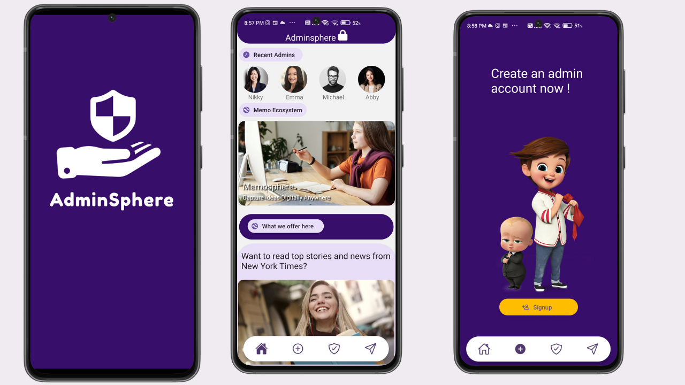
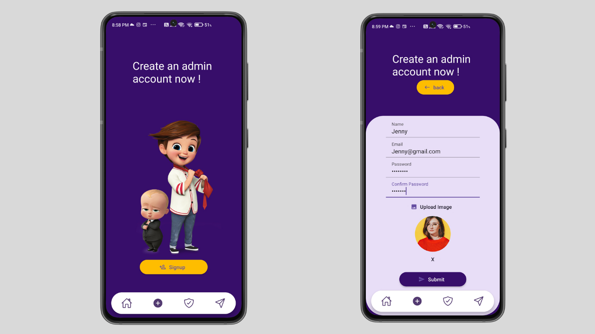
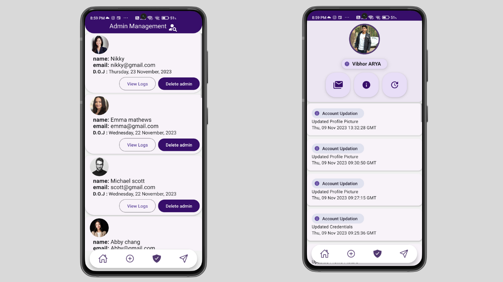
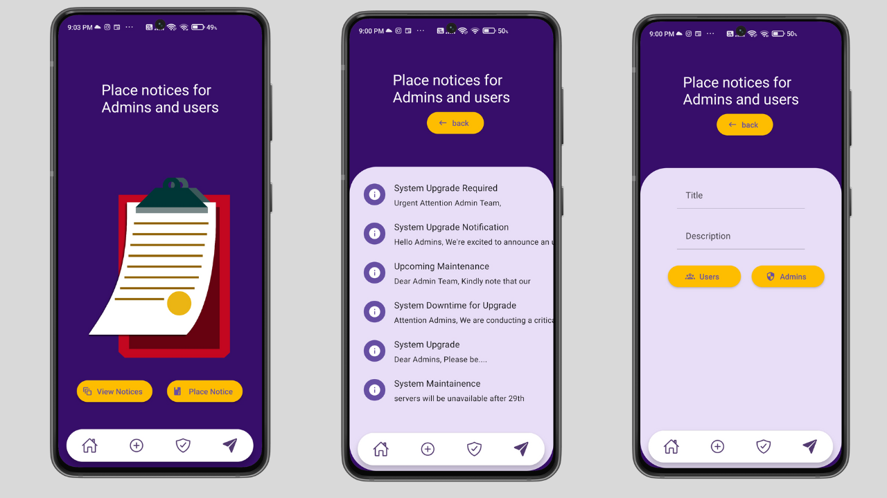
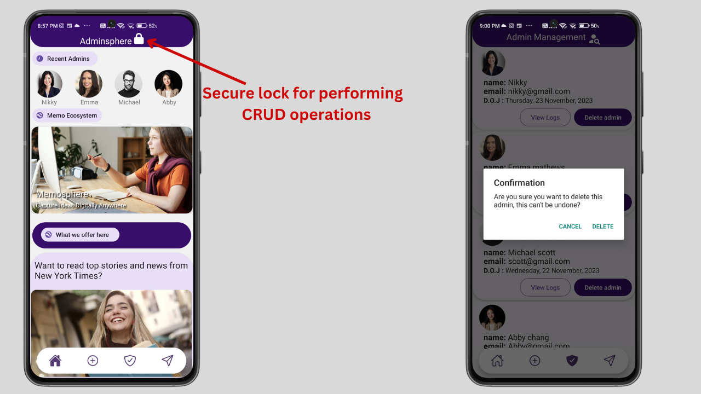

<h1 align="center">📱AdminSphere (React-native android app)⭐</h1>


## 📚 Project Overview
### AdminSphere is an Android application developed using React Native, designed to serve as a comprehensive employee management tool. It empowers administrators to create, manage, and monitor admin accounts efficiently. With features like access control, activity logs, and a notice board, AdminSphere streamlines organizational processes and enhances communication.

## 🖼️ Features
### Seamless Admin Onboarding
- ### AdminSphere includes a signup feature that enables the creation of admin accounts directly within the application. This functionality allows new administrators to quickly establish their accounts, gaining access to the platform's management tools and resources.


## Admin Management & Activity Logs
- ### AdminSphere provides a centralized platform for efficient admin management, including the ability to delete admin accounts as needed. Additionally, administrators can easily access and review activity logs, allowing for comprehensive monitoring of user actions within the application.


## Admin Notice Board
- ### AdminSphere offers a dedicated notice board feature, allowing administrators to post important announcements, updates, or reminders directly within the application. This functionality streamlines communication, ensuring that critical information reaches all relevant parties promptly and efficiently.


## 🔐 Guarded Access Feature
- ### AdminSphere incorporates a robust security measure in the form of a secure lock feature. When activated, this feature restricts access to sensitive operations such as deleting admin accounts, posting notices, and creating new admin accounts. Only authorized users with the appropriate credentials can unlock the feature, ensuring that critical actions are performed securely and responsibly.


## 🧰 Installation
run this locally
### Clone the Repository

```bash
git clone https://github.com/vibhorarya12/React-Native-Android-App
````
### Install Dependencies
Install dependencies using npm:
```bash
npm install
````
### Running the Application
For iOS:
```bash
npx react-native run-ios
````
For Android:
```bash
npx react-native run-android
````
⚠️To install the React Native CLI globally on your system, run the following command:
```bash
npm install -g react-native-cli
````
### Enviroment variables setup
create a new .env file
```bash
 touch .env
````
open .env file and add following  variables
```bash
PASS_KEY=abcd1234
API_KEY=Your_deployed_server_link_here
````
### server setup:
navigate to server directory
```bash
cd server
````
Install dependencies using npm
```bash
 npm install
````
#### Enviroment variables setup for server
within server directory create a new .env file
```bash
touch .env
````
open .env file and add these variables:
```bash
DATABASE = Your MongoDb atlas connection string here
JWT = Awz76234Screet@77
````
⚠️Note: for DATABASE variable a mongoDb atlas connection string is required . Please refer to https://www.mongodb.com/docs/guides/atlas/connection-string/

### deploy this server on render. please refer https://docs.render.com/deploy-node-express-app 


